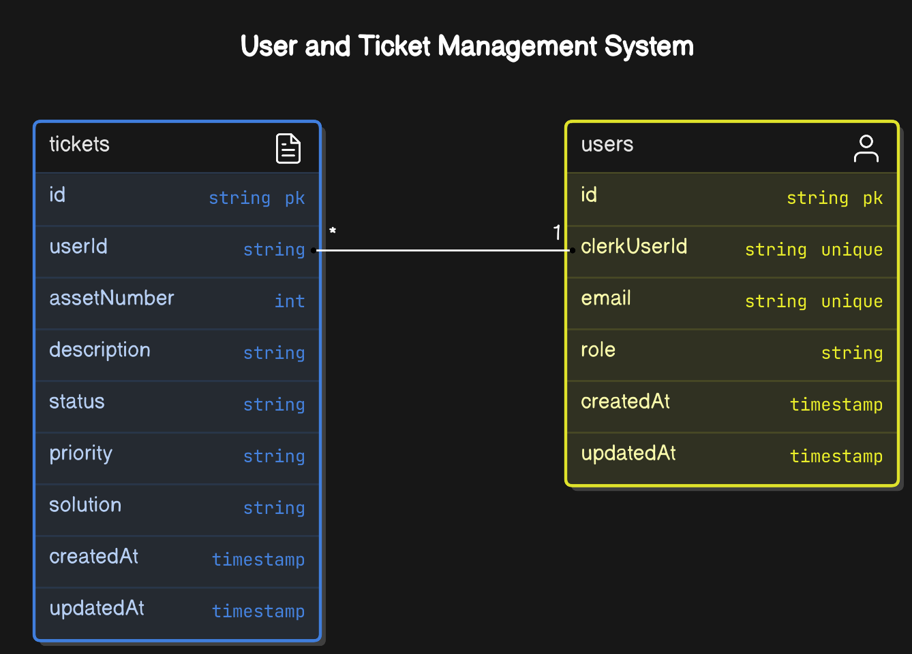

## 🎫 Help Desk

[](https://github.com/ClodoaldoDantas)
[](https://choosealicense.com/licenses/mit/)


### 🎯 Sobre

Plataforma web que permite aos usuários registrar novos chamados e acompanhar o status de suas resoluções de forma intuitiva e eficiente.



## 🚀 Tecnologias

- Next JS (App Router)
- Server Actions
- Typescript
- React
- shadcn/ui & Radix UI
- Tailwind CSS
- Clerk (Autenticação e Autorização)
- Neon Serverless Postgres
- Prisma ORM

 ### 💻 Como executar o projeto

1. Certifique-se de ter o Node instalado na sua máquina.
2. Clone o repositório.
3. Navegue até o diretório raiz do projeto.
4. Preencha as variáveis de ambiente de acordo com o arquivo `.env.example`
5. Execute o comando `npm install` para instalar as dependências do projeto.
6. Execute o comando `npm run dev` para iniciar o servidor de desenvolvimento.
7. Acesse o projeto em seu navegador através do endereço `http://localhost:3000`.

## 🔒 Admin

Para testar como a aplicação funciona quando acessada por um **Administrador**, você pode utilizar o usuário abaixo:

```
E-mail: admin@admin.com
Senha: helpdeskadmin
```

### 📝 Licença
Esse projeto está sob a licença MIT.
